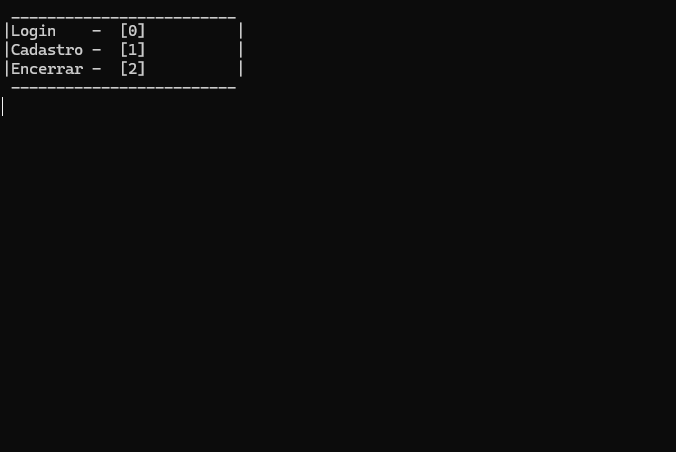
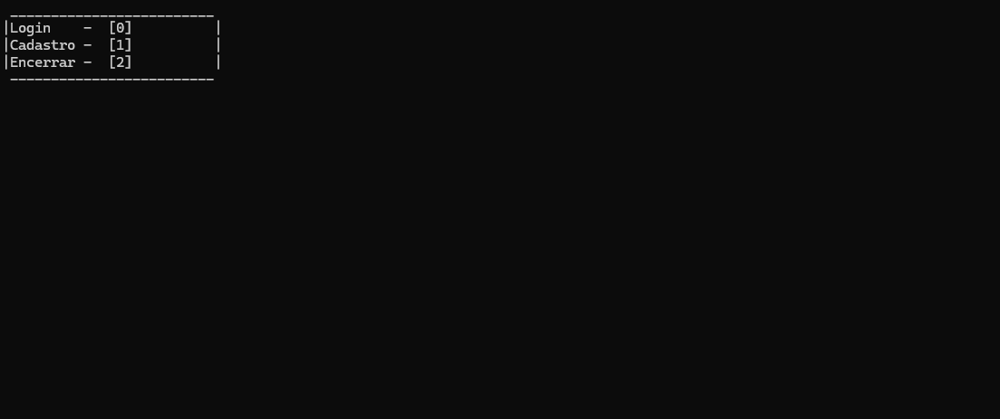
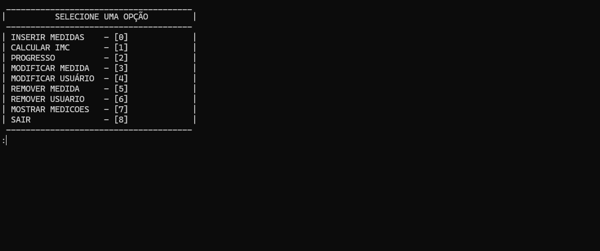
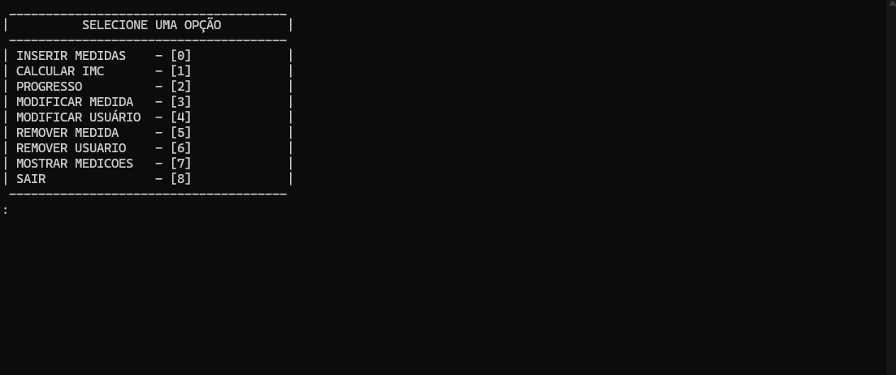

  
  
  
  
  

## 🚀 Funcionalidades

### **Gerenciamento de usuários**
- Criar, remover, atualizar e listar usuários.

### **Controle de Medições**
- Registrar, modificar, listar e excluir medições físicas.

### **Persistência em JSON**
- Todos os dados são salvos em arquivos `.json`, garantindo fácil portabilidade.

### **Arquitetura organizada**
- Estruturado em camadas para manter o código limpo e desacoplado.

### **Menu Interativo**
- Interface de linha de comando simples e intuitiva.

---

## 🎬 Demonstração

<h3 align="center">Cadastro</h3>

  

<h3 align="center">Login</h3>

  

<h3 align="center">Inserir Medições</h3>

  

<h3 align="center">Calcular IMC</h3>

  

<h3 align="center">Modificar Medida</h3>

  

<h3 align="center">Modificar Usuário</h3>

  

<h3 align="center">Remover Medida</h3>

  

<h3 align="center">Remover Usuário</h3>

  

